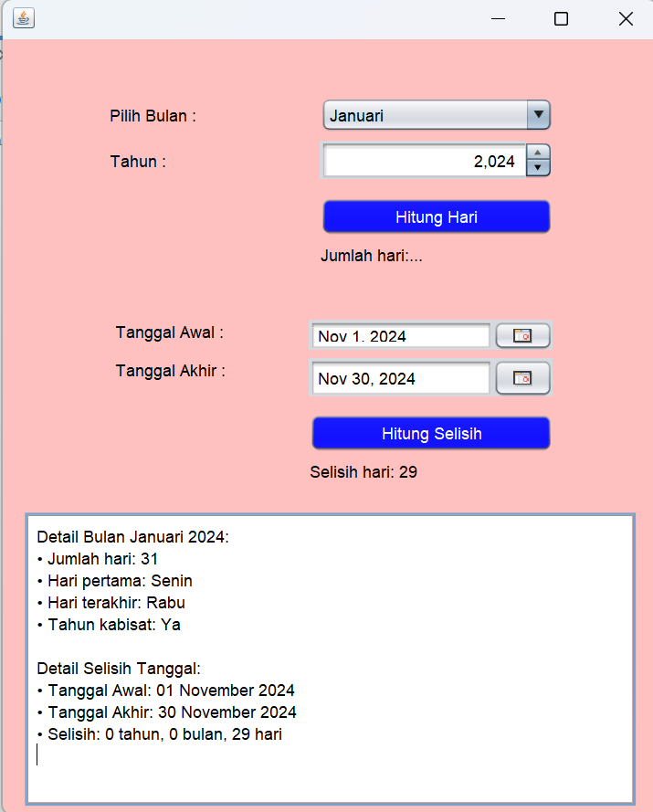

# PerhitunganHari
 Tugas 4 - Annisa (2210010581)
 
# Aplikasi Perhitungan Hari
 
Aplikasi Perhitungan hari adalah Aplikasi untuk menghitung hari dalam bulan

# Keunggulan Aplikasi

- Perhitungan Hari: Aplikasi ini menyediakan hitung hari, tahun kabisat dan ada hitung selisih hari

# Pembuat Aplikasi
 Annisa - 2210010581 - Tugas 4 

# Fitur

Aplikasi ini menawarkan fitur:

Perhitungan Hari
Tahun kabisat
Hitung selisih Hari

## Cara Menjalankan

1. Run File
2. Pilih Bulan Yang Kita Input
3. Tekan button Hitung hari, maka akan terlihat hasil hitung hari
4. Pilih tanggal awal dan tanggal akhir 
5. Tekan button hitung selisih, maka akan terlihat hasil selisih hitung hari 

# Demo

